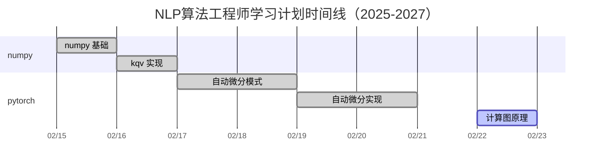

```mermaid
gantt
    title NLP算法工程师学习计划时间线（2025-2027）
    dateFormat  YYYY-MM-DD
    axisFormat  %m/%d

    section numpy
    numpy 基础 :done, numpy, 2025-02-15,  1d
    kqv 实现: done, sa, after numpy,  1d

    section pytorch
    自动微分模式 : done, ad, after sa,  2d
    自动微分实现 : done, ada, after ad, 2d
    计算图原理 : active, cg, 2025-02-22, 1d

```
